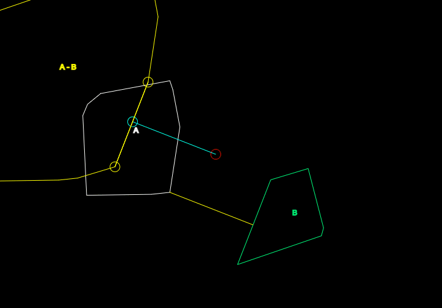

## Asteroids in Vanilla Javascript (cozyhome/asteroids-js)

  

This repository houses my attempt at implementing Asteroids in JS. It's really just an excuse to create an AABB library and utilize it with some form of quad-tree or AABB-tree esque structure as the broad phase. DGJK will be used as a narrow phase collision system with both CCD and DC solvers for the player against all items in the scene. 
   

## p5js Sketch Examples:
As always, this will be assisted with p5js and P2D to make bootstrapping easy.